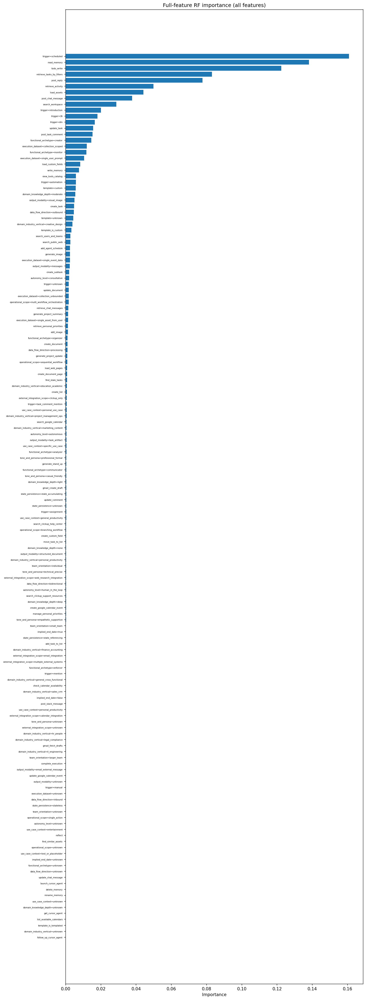
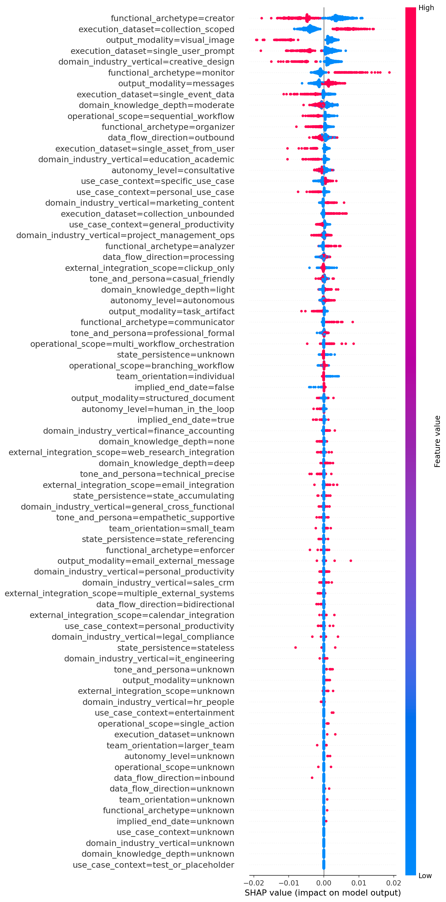
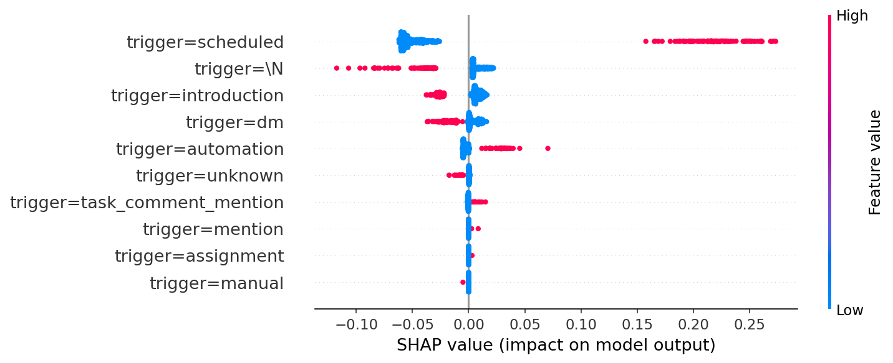
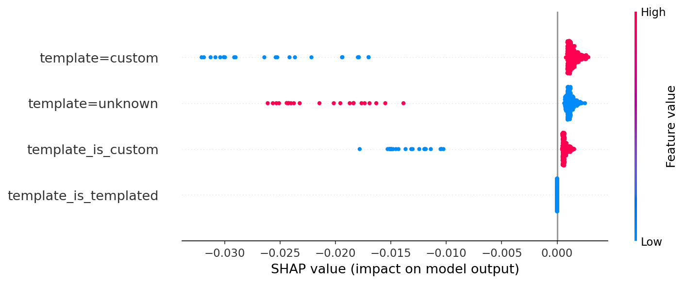
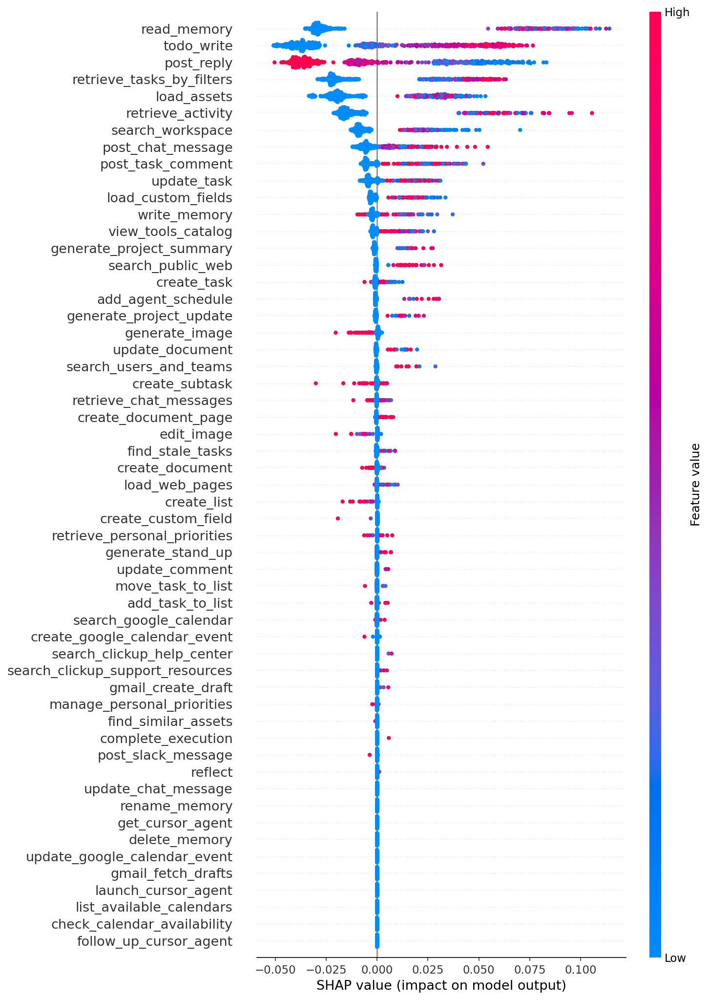
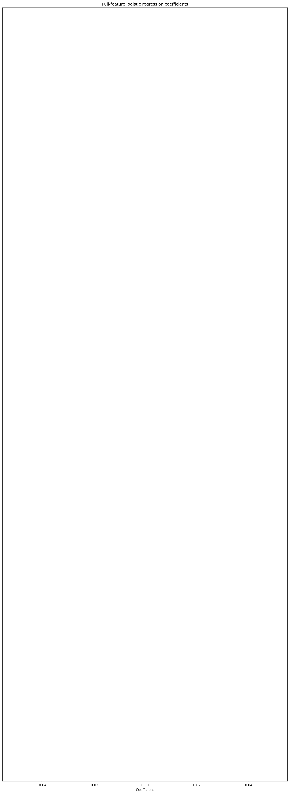
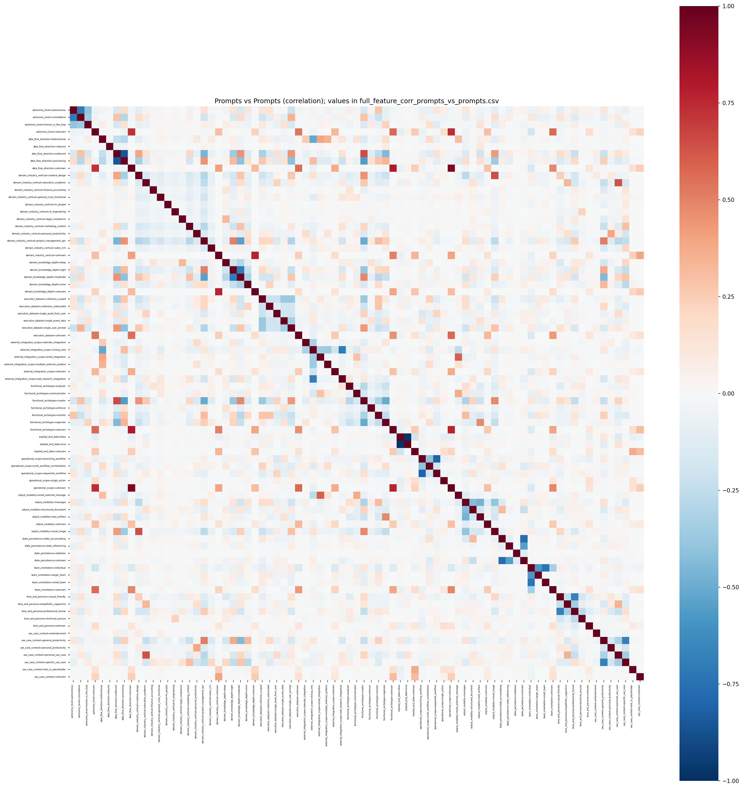
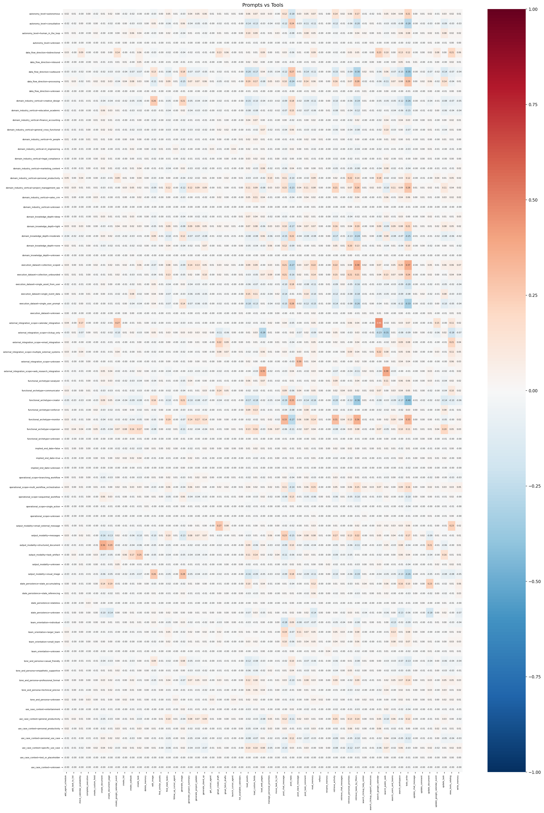
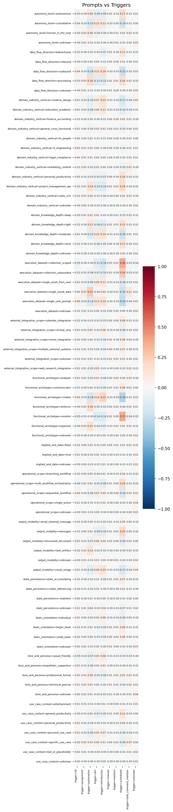
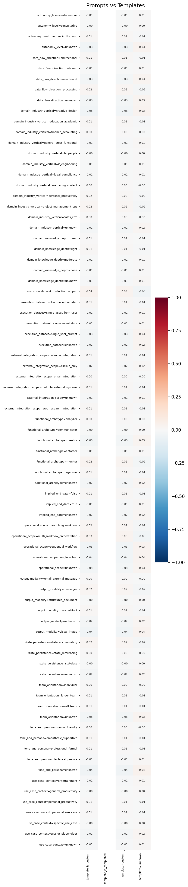

# Full-feature exhaustive readout

**Last updated:** 2026-03-11  
**Scope:** Single readout with **all** features (prompt classifications, triggers, templates, tools) in one model. Data: classified cohort only (agents in `agent_classifications.csv` with success_segment from cohort). Success/failure/dormant definitions match the main agent success readout.

---

## 1. Distribution

### 1.1 Trigger (primary trigger per agent)

Value × segment counts and success rate (classified cohort).

| trigger_source | dormant | failure | success | success_rate |
|----------------|---------|---------|---------|--------------|
| \\N | 13,051 | 1,154 | 1,654 | 0.104 |
| assignment | 586 | 86 | 559 | 0.454 |
| automation | 2,191 | 969 | 4,741 | 0.600 |
| dm | 26,109 | 1,321 | 7,493 | 0.215 |
| introduction | 23,326 | 519 | 219 | 0.009 |
| manual | 28 | 33 | 36 | 0.371 |
| mention | 241 | 44 | 229 | 0.446 |
| scheduled | 646 | 1,767 | 20,746 | 0.896 |
| task_comment_mention | 913 | 150 | 1,035 | 0.493 |
| unknown | 3,449 | 568 | 0 | 0.000 |

**Commentary:** Scheduled trigger has by far the highest success rate (89.6%) and a large share of success agents. Introduction and unknown have the lowest success rates (0.9% and 0%); introduction dominates the dormant segment. The distribution shows that trigger type is strongly associated with outcome: scheduled and automation are success-heavy, introduction and dm are dormant/failure-heavy.

### 1.2 Template (primary template per agent)

| TEMPLATE_TYPE | dormant | failure | success | success_rate |
|---------------|---------|---------|---------|--------------|
| custom | 67,091 | 6,043 | 36,712 | 0.334 |
| unknown | 3,449 | 568 | 0 | 0.000 |

**Commentary:** Almost all success agents use custom template; unknown template is associated entirely with non-success (dormant/failure). Custom template is necessary but not sufficient for success.

### 1.3 Tools (mean avg calls per run by segment)

Full table: [analysis/output/full_feature_tool_by_segment.csv](../analysis/output/full_feature_tool_by_segment.csv). Rows = tool name; columns = dormant, failure, success (mean usage per run).

**Commentary:** Success agents show higher mean usage for task/retrieval tools (e.g. todo_write, retrieve_tasks_by_filters, create_task, read_memory, write_memory, retrieve_activity) and lower reliance on generate_image compared with dormant. Tool usage differentiates segments clearly.

### 1.4 Prompts (classification dimensions)

Per-dimension value × segment and success rate are in `analysis/output/classification_dim_<dim>.csv` for each of the 14 dimensions (team_orientation, domain_knowledge_depth, operational_scope, data_flow_direction, autonomy_level, functional_archetype, tone_and_persona, execution_dataset, state_persistence, external_integration_scope, output_modality, domain_industry_vertical, use_case_context, implied_end_date).

**Commentary:** Execution_dataset (e.g. collection_scoped vs single_user_prompt) and functional_archetype (e.g. monitor vs creator) show large success-rate gaps. See the prompts-only classification readout for detailed per-dimension inference.

---

## 2. Population

| success_segment | count | success_rate |
|-----------------|-------|---------------|
| dormant | 70,540 | 0.322 |
| success | 36,712 | 0.322 |
| failure | 6,611 | 0.322 |

*success_rate column = overall cohort success rate (success / total).*

**Commentary:** Classified cohort has 113,863 agents. Overall success rate is 32.2%. Dormant agents outnumber success; failure is the smallest segment. The full-feature model uses this cohort to predict success vs non-success.

---

## 3. Random forest

Model: all features (prompts one-hot, trigger one-hot, template one-hot + flags, tool avg per run). Target: success vs non-success. Full table: [analysis/output/full_feature_rf_importance.csv](../analysis/output/full_feature_rf_importance.csv).

**Top 30 features by importance:**

| feature | importance |
|---------|------------|
| trigger=scheduled | 0.161 |
| read_memory | 0.138 |
| todo_write | 0.122 |
| retrieve_tasks_by_filters | 0.083 |
| post_reply | 0.078 |
| retrieve_activity | 0.050 |
| load_assets | 0.044 |
| post_chat_message | 0.038 |
| search_workspace | 0.029 |
| trigger=introduction | 0.020 |
| trigger=\\N | 0.018 |
| trigger=dm | 0.017 |
| update_task | 0.016 |
| post_task_comment | 0.015 |
| functional_archetype=creator | 0.015 |
| execution_dataset=collection_scoped | 0.012 |
| functional_archetype=monitor | 0.012 |
| execution_dataset=single_user_prompt | 0.010 |
| load_custom_fields | 0.008 |
| write_memory | 0.008 |
| view_tools_catalog | 0.006 |
| trigger=automation | 0.006 |
| template=custom | 0.006 |
| domain_knowledge_depth=moderate | 0.005 |
| output_modality=visual_image | 0.005 |
| create_task | 0.005 |
| data_flow_direction=outbound | 0.005 |
| template=unknown | 0.004 |
| domain_industry_vertical=creative_design | 0.004 |
| template_is_custom | 0.003 |

**Full bar chart (all features):**

**Commentary:** Trigger and tools dominate: trigger=scheduled is the top feature, followed by read_memory, todo_write, retrieve_tasks_by_filters, and post_reply. Classification dimensions (execution_dataset, functional_archetype, output_modality, domain_knowledge_depth, domain_industry_vertical) and template appear in the top 30. The model suggests that scheduled trigger and task/memory/chat tool usage are the strongest predictors of success; introduction and creator/single_user_prompt/visual_image are negative signals.

---

## 4. SHAP

Full table: [analysis/output/full_feature_shap_direction.csv](../analysis/output/full_feature_shap_direction.csv) (feature, mean_shap, mean_abs_shap). SHAP computed on a 500-agent sample.

**Top 20 by mean absolute SHAP:**

| feature | mean_shap | mean_abs_shap |
|---------|-----------|---------------|
| trigger=scheduled | −0.0012 | 0.083 |
| read_memory | 0.0045 | 0.044 |
| todo_write | 0.0009 | 0.034 |
| post_reply | −0.0001 | 0.034 |
| retrieve_tasks_by_filters | 0.0011 | 0.028 |
| load_assets | −0.0001 | 0.024 |
| retrieve_activity | −0.0020 | 0.022 |
| trigger=\\N | 0.0005 | 0.014 |
| search_workspace | −0.0004 | 0.012 |
| trigger=introduction | 0.0006 | 0.012 |
| trigger=dm | −0.0017 | 0.009 |
| post_chat_message | 0.0011 | 0.008 |
| post_task_comment | 0.0009 | 0.008 |
| update_task | −0.0001 | 0.006 |
| trigger=automation | −0.0002 | 0.005 |
| functional_archetype=creator | 0.0001 | 0.005 |
| execution_dataset=collection_scoped | −0.0009 | 0.005 |
| load_custom_fields | 0.0000 | 0.004 |
| write_memory | −0.0006 | 0.003 |
| output_modality=visual_image | 0.0003 | 0.003 |

**Commentary:** Trigger and tools again have the largest mean absolute SHAP. Mean signed SHAP is small for many features (model is non-linear); execution_dataset=collection_scoped has negative mean SHAP on this sample despite being associated with success in the population—sample and main-effect interpretation can differ. RF importance and SHAP magnitude are aligned: scheduled, read_memory, todo_write, retrieve_tasks_by_filters, post_reply drive predictions most.

---

## 5. SHAP beeswarm

Beeswarm plots are split by feature group for readability. Each shows SHAP value (x) vs feature value (y) for the 500-agent sample.

**Prompts:**

**Triggers:**

**Templates:**

**Tools:**

**Commentary:** The beeswarms show spread and direction: high trigger=scheduled and high read_memory/todo_write/retrieve_tasks_by_filters push toward success (positive SHAP); high trigger=introduction and high generate_image push toward failure (negative SHAP). Prompt one-hots show concentration at 0 or 1 with corresponding SHAP spread. The split by group keeps each plot readable despite 150+ total features.

---

## 6. Average SHAP per feature

Full table: [analysis/output/full_feature_shap_by_value.csv](../analysis/output/full_feature_shap_by_value.csv). For one-hot features: mean SHAP when value=0 vs value=1. For tool (continuous) features: mean SHAP by quartile (q1–q4).

**Commentary:** For one-hots, value=1 with positive mean_shap pushes toward success (e.g. trigger=scheduled=1, execution_dataset=collection_scoped=1); value=1 with negative mean_shap pushes toward failure (e.g. trigger=introduction=1, functional_archetype=creator=1). For tools, higher quartiles of read_memory/todo_write tend to have positive mean SHAP; higher quartiles of generate_image tend to have negative mean SHAP. This aligns with the RF and beeswarm story.

---

## 7. Logistic regression

Full table: [analysis/output/full_feature_logistic_coefficients.csv](../analysis/output/full_feature_logistic_coefficients.csv). Features standardized before fitting.

**Top 15 positive and top 15 negative coefficients (by coefficient value):**

| feature | coefficient |
|---------|-------------|
| trigger=scheduled | +0.867 |
| template=custom | +0.405 |
| template_is_custom | +0.405 |
| todo_write | +0.316 |
| trigger=dm | +0.245 |
| complete_execution | +0.211 |
| retrieve_tasks_by_filters | +0.127 |
| read_memory | +0.110 |
| domain_industry_vertical=marketing_content | +0.108 |
| trigger=automation | +0.155 |
| list_available_calendars | +0.137 |
| trigger=task_comment_mention | +0.134 |
| write_memory | +0.076 |
| retrieve_activity | +0.076 |
| load_assets | +0.068 |
| ... | ... |
| trigger=introduction | −0.924 |
| post_reply | −0.667 |
| trigger=unknown | −0.405 |
| template=unknown | −0.405 |
| output_modality=visual_image | −0.140 |
| generate_image | −0.151 |
| post_chat_message | −0.158 |
| domain_industry_vertical=creative_design | −0.142 |
| domain_industry_vertical=education_academic | −0.107 |
| functional_archetype=creator | −0.089 |
| post_task_comment | −0.086 |
| edit_image | −0.094 |
| create_list | −0.071 |
| rename_memory | −0.068 |
| execution_dataset=single_user_prompt | −0.065 |
| execution_dataset=single_asset_from_user | −0.057 |
| ... | ... |

**Full bar chart (all features):**

**Commentary:** Logistic coefficients are interpretable as log-odds: trigger=scheduled is the strongest positive driver; trigger=introduction is the strongest negative. Execution_dataset=collection_scoped is strongly positive; single_user_prompt and single_asset_from_user are strongly negative. Creative and education verticals are negative; marketing, project_management_ops, personal_productivity are positive. This is consistent with RF and SHAP and with the prompts-only readout.

---

## 8. Correlation matrices

Pearson correlation on the full agent-level table (all numeric features). Four sub-matrices are saved as CSVs and as color-coded heatmaps with values in cells (where readable).

### 8.1 Prompts vs Prompts

Full matrix: [analysis/output/full_feature_corr_prompts_vs_prompts.csv](../analysis/output/full_feature_corr_prompts_vs_prompts.csv). Heatmap (color only; diagonal = 1): [full_feature_corr_heatmap_prompts_vs_prompts.png](../analysis/output/full_feature_corr_heatmap_prompts_vs_prompts.png). Annotated (values in cells): [full_feature_corr_heatmap_prompts_vs_prompts_annot.png](../analysis/output/full_feature_corr_heatmap_prompts_vs_prompts_annot.png).

**Commentary:** Prompts vs prompts shows redundancy within dimensions (same dimension one-hots are negatively correlated by construction). Off-diagonal blocks show which dimension values co-occur; strong negative correlations between values of the same dimension are expected (one-hot). The matrix helps check collinearity for modeling.

### 8.2 Prompts vs Tools

Full matrix: [analysis/output/full_feature_corr_prompts_vs_tools.csv](../analysis/output/full_feature_corr_prompts_vs_tools.csv).

**Commentary:** Functional_archetype=monitor and execution_dataset=collection_scoped correlate positively with todo_write, retrieve_tasks_by_filters, read_memory; functional_archetype=creator and output_modality=visual_image correlate positively with generate_image and post_reply. This matches the RF/SHAP story: prompt dimensions that favor success align with task/memory tools; creator/image prompts align with image and reply tools.

### 8.3 Prompts vs Triggers

Full matrix: [analysis/output/full_feature_corr_prompts_vs_triggers.csv](../analysis/output/full_feature_corr_prompts_vs_triggers.csv).

**Commentary:** trigger=scheduled correlates positively with execution_dataset=collection_scoped, functional_archetype=monitor, and similar “success-prone” prompt values; trigger=introduction correlates positively with functional_archetype=creator, execution_dataset=single_user_prompt, output_modality=visual_image. So prompt levers and trigger type are aligned at the agent level: scheduled + collection-scoped/monitor vs introduction + creator/single-prompt/image.

### 8.4 Prompts vs Templates

Full matrix: [analysis/output/full_feature_corr_prompts_vs_templates.csv](../analysis/output/full_feature_corr_prompts_vs_templates.csv).

**Commentary:** template=custom and template_is_custom dominate (most agents use custom). Correlations with prompt one-hots are modest; template=unknown correlates with failure-prone prompt values (e.g. creator, single_user_prompt). Template is a coarse lever; prompt dimensions add finer signal.

---

## Document-level footnotes

**Success vs failure criteria**  
- **Success:** After 7 days of creation, the agent has been used at least once and is still **active**.  
- **Failure:** Agent is **inactive** and/or **deleted**.  
- **Dormant:** Created, not deleted, **active**, but **no usage post 7 days** of creation.  
- **Parameters:** analysis_reference_date (see cohort metadata); days_post_creation = 7.

**Assumptions**  
- Classified cohort only (agents in agent_classifications.csv).  
- Full-feature model includes prompts (one-hot), primary trigger (one-hot), template (one-hot + flags), and tool usage (avg calls per run per tool).  
- Correlation is agent-level; Pearson correlation.

**Limitations**  
- Correlation does not imply causation.  
- SHAP and logistic coefficients can be sensitive to sample and scaling.  
- Heatmaps for 80×80 prompts vs prompts are large; annotated version may use small font; full values are in the CSV.
