# Prompts-only classification readout

**Last updated:** 2026-04-03  
**Maintenance:** This file and `prompts_classification_readout_plain.html` are edited by hand. Refresh numbers, charts, and `analysis/output/leadership_corr_heatmap_map.json` by running the analysis scripts; there is no doc generator for these readouts.  
**Scope:** Classification dimensions only (no triggers or tools in the success model). Correlation sections add tools, triggers, and templates for context.  
**Data:** Classified cohort (agents in `agent_classifications.csv` with success_segment from cohort).  
**Value meanings:** See [semantic_layer/models/agent_classifications.md](semantic_layer/models/agent_classifications.md).  
**Interactive view:** [prompts_classification_readout_plain.html](prompts_classification_readout_plain.html) loads heatmap paths from `../analysis/output/leadership_corr_heatmap_map.json` at runtime (serve over HTTP if `file://` blocks fetch).

## Executive summary

- **Purpose:** Link **prompt classifications** to **success vs non-success** (same cohort definitions as the main agent success readout).
- **Prompts-only model:** **Random Forest**, **SHAP**, and **logistic regression** on one-hot classification features only (no triggers/templates in that model).
- **Correlation blocks:** Agent-level **Pearson** between prompt dimensions and tools/triggers/templates (|r| ≥ 0.05 in dimension tables).
- **Cohort size:** Classified agents with segment counts below; ~**114K** prompts in classification pass.
- **Lead takeaway:** **Collection-scoped** execution and **monitor** archetype align with success; **single-user prompt** execution and **creator** archetype align with lower modeled success—details in **Key findings**.

**Detailed data analysis and methodologies** — See [Methodology and footnotes](#methodology-and-footnotes).

## Key findings

<strong>Finding 1 — Execution dataset</strong> — <em>Scoped collections dominate RF/LR; one-off user prompts trail.</em>

- **collection_scoped** — **Highest RF importance** (0.174) and **strong positive LR** (+0.346): agents scoped to a defined collection tend to model as more successful.
- **single_user_prompt** — **Strong negative** in both RF (0.069) and LR (-0.273): ad-hoc user Q&amp;A style aligns with lower modeled success.
- **Other execution_dataset levels** — **collection_unbounded** RF/LR (0.047 / +0.228); **single_event_data** and **single_asset_from_user** (0.031/-0.068; 0.027/-0.258).

**Distribution (classified cohort)**
### 2. Execution dataset

**Classification**  
What the agent works on per invocation (single event, user prompt, asset, collection_scoped, collection_unbounded, messages).

**Distribution**

| Value | What each value means | Dormant | Failure | Success | Success rate | Top 3 tools (pos; r) | Top 3 tools (neg; r) | Top 3 prompts (pos; r) | Top 3 prompts (neg; r) |
|-------|------------------------|---------|---------|---------|--------------|----------------------|----------------------|------------------------|------------------------|
| collection_scoped | Queries a defined scope (lists, time windows). | 11,213 | 3,125 | 18,728 | 0.57 | retrieve_tasks_by_filters 0.38; todo_write 0.37; read_memory 0.22 | post_reply -0.27 | functional_archetype=monitor 0.28; data_flow_direction=processing 0.27; operational_scope=multi_workflow_orchestration 0.23 | functional_archetype=creator -0.37; data_flow_direction=outbound -0.32; output_modality=visual_image -0.22 |
| collection_unbounded | Searches broadly with no predetermined boundary. | 3,458 | 1,134 | 6,593 | 0.59 | todo_write 0.24; retrieve_tasks_by_filters 0.21 | — | functional_archetype=monitor 0.28; domain_knowledge_depth=none 0.22; domain_industry_vertical=project_management_ops 0.21 | functional_archetype=creator -0.21; domain_knowledge_depth=moderate -0.18; data_flow_direction=outbound -0.15 |
| single_asset_from_user | User provides material; agent parses/transforms it. | 10,795 | 194 | 999 | 0.08 | — | todo_write -0.20 | domain_industry_vertical=education_academic 0.23; functional_archetype=creator 0.23; operational_scope=sequential_workflow 0.22 | operational_scope=branching_workflow -0.15; domain_industry_vertical=project_management_ops -0.15; data_flow_direction=processing -0.13 |
| single_event_data | Triggered by one ClickUp automation event. | 19,695 | 1,529 | 7,100 | 0.25 | — | retrieve_tasks_by_filters -0.18 | output_modality=task_artifact 0.16; data_flow_direction=processing 0.15; functional_archetype=organizer 0.15 | functional_archetype=monitor -0.16; data_flow_direction=outbound -0.12; autonomy_level=consultative -0.11 |
| single_user_prompt | User sends a request; agent creates in response. | 25,106 | 594 | 3,061 | 0.11 | post_reply 0.28 | todo_write -0.33; retrieve_tasks_by_filters -0.26; load_assets -0.18 | data_flow_direction=outbound 0.44; functional_archetype=creator 0.43; autonomy_level=consultative 0.35 | data_flow_direction=processing -0.41; domain_industry_vertical=project_management_ops -0.30; domain_knowledge_depth=light -0.23 |
| unknown | Could not be determined. | 273 | 35 | 231 | 0.43 | — | — | operational_scope=unknown 0.57; data_flow_direction=unknown 0.56; autonomy_level=unknown 0.54 | team_orientation=individual -0.15; operational_scope=branching_workflow -0.07; external_integration_scope=clickup_only -0.06 |

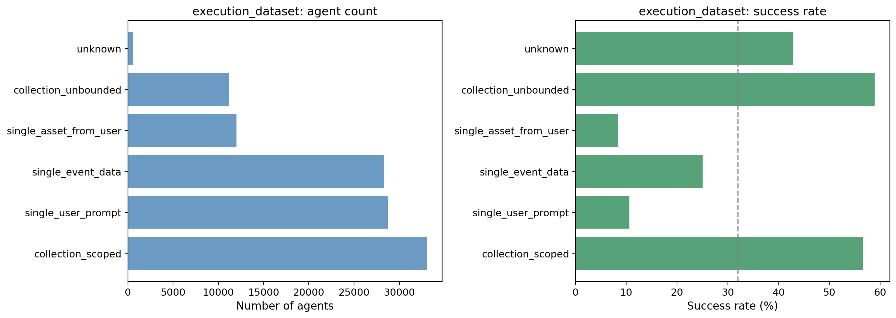

**Inference:** single_user_prompt and single_asset_from_user have very low success rates (0.11 and 0.08). collection_scoped and collection_unbounded have the highest (0.57 and 0.59). Collection-based execution is strongly associated with success.

**Direction (success vs fail)**

- **Population:** collection_scoped (0.57) and collection_unbounded (0.59) lead; single_user_prompt (0.11) and single_asset_from_user (0.08) trail.
- **Prompts-only model:** execution_dataset=collection_scoped has the highest RF importance (0.174) and strong positive coefficient (+0.35); execution_dataset=single_user_prompt and execution_dataset=single_asset_from_user are strongly negative (−0.27, −0.26). Direction is very clear: collection-scoped toward success, single-user-prompt/asset toward failure.

**Correlation with tools, triggers, templates**  
See table above. collection_scoped correlates with scheduled and task/retrieval tools; single_user_prompt with introduction.

**Other insights**  
Execution dataset is one of the strongest predictors. Shifting prompts toward collection-scoped or unbounded semantics and away from single-user-prompt/asset may improve success.

**Footnotes**  
Correlations are agent-level Pearson (|r| ≥ 0.05); primary trigger/template and avg tool usage per run. **Correlation color code:** Green = positive correlation with this dimension value; Red = negative correlation.

---

<strong>Finding 2 — Functional archetype</strong> — <em>Monitor lifts outcomes; creator-heavy prompts stall.</em>

- **creator** — **Largest negative** modeled pull: high RF importance with **LR ≈ −0.20**; population success rate ~**12%** (see table).
- **monitor** — **Strong positive** RF/LR (**+0.22** logistic); success rate ~**67%** — monitoring-style tasks track with better outcomes in both model and raw rates.

### 1. Functional archetype

**Classification**  
The agent's primary job function (creator, organizer, analyzer, communicator, monitor, enforcer).

**Distribution**

| Value | What each value means | Dormant | Failure | Success | Success rate | Top 3 tools (pos; r) | Top 3 tools (neg; r) | Top 3 prompts (pos; r) | Top 3 prompts (neg; r) |
|-------|------------------------|---------|---------|---------|--------------|----------------------|----------------------|------------------------|------------------------|
| analyzer | Produces insights, metrics, or recommendations from data. | 6,656 | 867 | 4,884 | 0.39 | — | — | output_modality=messages 0.16; domain_industry_vertical=finance_accounting 0.14; external_integration_scope=web_research_integration 0.11 | output_modality=visual_image -0.13; output_modality=task_artifact -0.13; domain_industry_vertical=creative_design -0.12 |
| communicator | Drafts and sends messages (emails, DMs, notifications). | 2,129 | 500 | 2,528 | 0.49 | — | — | output_modality=email_external_message 0.38; external_integration_scope=email_integration 0.30; data_flow_direction=bidirectional 0.15 | external_integration_scope=clickup_only -0.16; output_modality=task_artifact -0.10; output_modality=structured_document -0.09 |
| creator | Generates new content (writing, images, docs, code). | 38,672 | 734 | 5,307 | 0.12 | post_reply 0.33; generate_image 0.21 | todo_write -0.40; retrieve_tasks_by_filters -0.36; retrieve_activity -0.20 | data_flow_direction=outbound 0.65; domain_knowledge_depth=moderate 0.49; output_modality=visual_image 0.48 | data_flow_direction=processing -0.56; domain_industry_vertical=project_management_ops -0.50; domain_knowledge_depth=light -0.38 |
| enforcer | Enforces rules, compliance, or corrections. | 1,947 | 375 | 1,640 | 0.41 | — | — | data_flow_direction=processing 0.16; execution_dataset=single_event_data 0.14; domain_knowledge_depth=deep 0.14 | data_flow_direction=outbound -0.14; domain_knowledge_depth=moderate -0.11; autonomy_level=consultative -0.10 |
| monitor | Observes and reports; does not create or enforce. | 3,297 | 1,750 | 10,049 | 0.67 | retrieve_tasks_by_filters 0.36; todo_write 0.33; post_chat_message 0.33 | post_reply -0.27 | output_modality=messages 0.32; domain_industry_vertical=project_management_ops 0.31; data_flow_direction=processing 0.29 | domain_knowledge_depth=moderate -0.28; data_flow_direction=outbound -0.26; execution_dataset=single_user_prompt -0.23 |
| organizer | Structures, routes, or categorizes existing work items. | 17,770 | 2,373 | 12,265 | 0.38 | update_task 0.20 | — | output_modality=task_artifact 0.48; data_flow_direction=processing 0.34; domain_industry_vertical=project_management_ops 0.25 | data_flow_direction=outbound -0.44; output_modality=visual_image -0.25; domain_knowledge_depth=moderate -0.23 |
| unknown | Could not be determined. | 69 | 12 | 39 | 0.32 | — | — | data_flow_direction=unknown 0.79; operational_scope=unknown 0.76; autonomy_level=unknown 0.58 | team_orientation=individual -0.13; implied_end_date=false -0.08; external_integration_scope=clickup_only -0.06 |

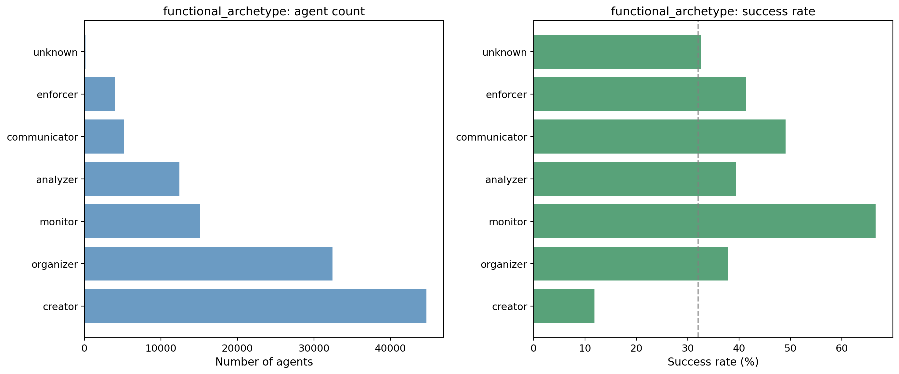

**Inference:** Creator is the most common but has the lowest success rate (12%). Monitor has the highest success rate (67%). Organizer and analyzer are common with moderate success (~0.38–0.39).

**Direction (success vs fail)**

- **Population:** Monitor (0.67) and communicator (0.49) lead; creator (0.12) trails.
- **Prompts-only model:** functional_archetype=creator has high importance (0.134) and strong negative coefficient (−0.20); functional_archetype=monitor has high importance (0.090) and strong positive coefficient (+0.22). Creator pushes toward failure, monitor toward success.

**Correlation with tools, triggers, templates**  
See table above for top tools and other prompt categories (|r| ≥ 0.05). Monitor correlates with scheduled trigger and task/todo tools; creator with post_reply and introduction.

**Other insights**  
Creator-heavy prompts dominate but underperform; monitor and communicator are strong success levers. Product could favor monitor/communicator patterns where appropriate.

**Footnotes**  
Correlations are agent-level Pearson (|r| ≥ 0.05); primary trigger/template and avg tool usage per run. **Correlation color code:** Green = positive correlation with this dimension value; Red = negative correlation.

---

<strong>Finding 3 — Prompt × tool/trigger links</strong> — <em>High-|r| pairs with calendar-style tools de-ranked—open for surprises.</em>

- **functional_archetype=creator** ↔ **todo_write** — *r* = **-0.40** — Lower rate of **todo_write** among agents with **functional_archetype=creator** (co-movement; not causal).
- **execution_dataset=collection_scoped** ↔ **retrieve_tasks_by_filters** — *r* = **0.38** — Higher rate of **retrieve_tasks_by_filters** among agents with **execution_dataset=collection_scoped** (co-movement; not causal).
- **external_integration_scope=web_research_integration** ↔ **search_public_web** — *r* = **0.38** — Higher rate of **search_public_web** among agents with **external_integration_scope=web_research_integration** (co-movement; not causal).
- **execution_dataset=collection_scoped** ↔ **trigger=scheduled** — *r* = **0.38** — Higher rate of **trigger=scheduled** among agents with **execution_dataset=collection_scoped** (co-movement; not causal).
- **functional_archetype=monitor** ↔ **trigger=scheduled** — *r* = **0.37** — Higher rate of **trigger=scheduled** among agents with **functional_archetype=monitor** (co-movement; not causal).
- **execution_dataset=collection_scoped** ↔ **todo_write** — *r* = **0.37** — Higher rate of **todo_write** among agents with **execution_dataset=collection_scoped** (co-movement; not causal).

---

## Distribution and model drivers

**Segments (classified cohort)**

| Segment | Count | Share | Success rate |
|---------|-------|-------|--------------|
| dormant | 70,540 | 62.0% | 0.32 |
| success | 36,712 | 32.2% | 0.32 |
| failure | 6,611 | 5.8% | 0.32 |

**Top drivers (RF importance + logistic coefficient)**

- **execution_dataset=collection_scoped** — RF **0.174**, LR **+0.346** (success-leaning)
- **functional_archetype=monitor** — RF **0.090**, LR **+0.218** (success-leaning)
- **execution_dataset=collection_unbounded** — RF **0.047**, LR **+0.228** (success-leaning)
- **data_flow_direction=outbound** — RF **0.041**, LR **+0.001** (success-leaning)
- **operational_scope=multi_workflow_orchestration** — RF **0.034**, LR **+0.155** (success-leaning)
- **functional_archetype=creator** — RF **0.134**, LR **-0.200** (failure-leaning)
- **execution_dataset=single_user_prompt** — RF **0.069**, LR **-0.273** (failure-leaning)
- **output_modality=visual_image** — RF **0.036**, LR **-0.202** (failure-leaning)
- **domain_industry_vertical=creative_design** — RF **0.035**, LR **-0.190** (failure-leaning)
- **execution_dataset=single_event_data** — RF **0.031**, LR **-0.068** (failure-leaning)

---

## SHAP beeswarm

**How to read the beeswarm**

- **Each row** is one one-hot **prompt classification** feature.
- **Horizontal position** is **SHAP** impact on the success score (right = higher predicted success for that agent).
- **Color** encodes the **feature value** (present vs absent for that one-hot column).
- **Density** of dots shows how many agents land at each impact.

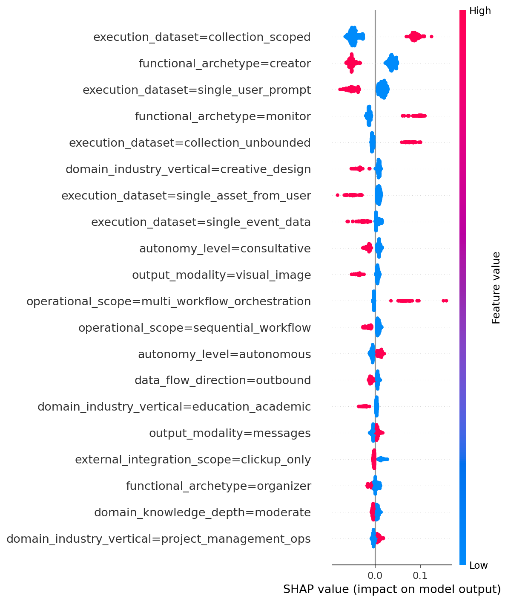

---

## Correlation matrix explorer

*Interactive heatmap selector is in the HTML readout.* Run `python analysis/full_feature_readout_analysis.py` to generate matrix PNGs under `analysis/output/`.

## Highlighted correlations

- **functional_archetype=creator** × **todo_write** — *r* = **-0.40** — Lower rate of todo_write among agents with functional_archetype=creator (co-movement; not causal).
- **execution_dataset=collection_scoped** × **retrieve_tasks_by_filters** — *r* = **0.38** — Higher rate of retrieve_tasks_by_filters among agents with execution_dataset=collection_scoped (co-movement; not causal).
- **external_integration_scope=web_research_integration** × **search_public_web** — *r* = **0.38** — Higher rate of search_public_web among agents with external_integration_scope=web_research_integration (co-movement; not causal).
- **execution_dataset=collection_scoped** × **trigger=scheduled** — *r* = **0.38** — Higher rate of trigger=scheduled among agents with execution_dataset=collection_scoped (co-movement; not causal).
- **functional_archetype=monitor** × **trigger=scheduled** — *r* = **0.37** — Higher rate of trigger=scheduled among agents with functional_archetype=monitor (co-movement; not causal).
- **execution_dataset=collection_scoped** × **todo_write** — *r* = **0.37** — Higher rate of todo_write among agents with execution_dataset=collection_scoped (co-movement; not causal).
- **output_modality=structured_document** × **create_document** — *r* = **0.36** — Higher rate of create_document among agents with output_modality=structured_document (co-movement; not causal).

---

## Other classification dimensions

### 3. Domain knowledge depth

**Classification**  
How much specialized field expertise is baked into the prompt (generic vs craft knowledge vs formal processes).

**Distribution**

| Value | What each value means | Dormant | Failure | Success | Success rate | Top 3 tools (pos; r) | Top 3 tools (neg; r) | Top 3 prompts (pos; r) | Top 3 prompts (neg; r) |
|-------|------------------------|---------|---------|---------|--------------|----------------------|----------------------|------------------------|------------------------|
| deep | Formal procedural knowledge; lifecycle, compliance. | 5,120 | 449 | 3,084 | 0.36 | — | — | domain_industry_vertical=legal_compliance 0.32; use_case_context=specific_use_case 0.21; functional_archetype=enforcer 0.14 | use_case_context=general_productivity -0.19; tone_and_persona=casual_friendly -0.14; domain_industry_vertical=creative_design -0.10 |
| light | Domain is the setting, not the skill. | 18,570 | 3,444 | 16,673 | 0.43 | todo_write 0.21; retrieve_tasks_by_filters 0.19; retrieve_activity 0.16 | post_reply -0.17 | domain_industry_vertical=project_management_ops 0.50; use_case_context=general_productivity 0.38; data_flow_direction=processing 0.32 | functional_archetype=creator -0.38; data_flow_direction=outbound -0.36; use_case_context=specific_use_case -0.25 |
| moderate | Domain craft knowledge essential; techniques, frameworks. | 41,878 | 1,830 | 12,405 | 0.22 | post_reply 0.22 | todo_write -0.25; retrieve_tasks_by_filters -0.24; retrieve_activity -0.17 | functional_archetype=creator 0.49; data_flow_direction=outbound 0.45; domain_industry_vertical=marketing_content 0.29 | domain_industry_vertical=project_management_ops -0.54; use_case_context=general_productivity -0.44; data_flow_direction=processing -0.41 |
| none | Generic instructions only; no domain references. | 4,962 | 885 | 4,544 | 0.44 | retrieve_personal_priorities 0.20; retrieve_tasks_by_filters 0.13; post_chat_message 0.12 | — | use_case_context=general_productivity 0.32; execution_dataset=collection_unbounded 0.22; domain_industry_vertical=project_management_ops 0.20 | use_case_context=specific_use_case -0.27; functional_archetype=creator -0.16; data_flow_direction=outbound -0.15 |
| unknown | Could not be determined. | 10 | 3 | 6 | 0.32 | — | — | domain_industry_vertical=unknown 0.77; functional_archetype=unknown 0.40; data_flow_direction=unknown 0.31 | implied_end_date=false -0.06; team_orientation=individual -0.06 |

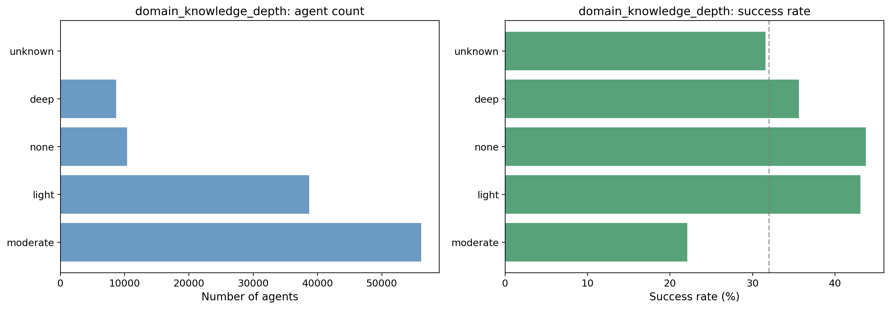

**Inference:** Moderate is the most common but has the lowest success rate (22%). Light and none have the highest success rates (~43–44%). Deeper domain depth in the prompt is associated with lower success in raw counts.

**Direction (success vs fail)**

- **Population:** Success rate highest for none and light (~0.43–0.44); lowest for moderate (0.22).
- **Prompts-only model:** domain_knowledge_depth=moderate has notable RF importance (0.022) and negative logistic coefficient (−0.044); domain_knowledge_depth=light is positive (+0.035). So moderate pushes toward failure, light toward success, consistent with population.

**Correlation with tools, triggers, templates**  
See table above. Moderate may correlate with trigger=introduction or creator-heavy tools; light/none with scheduled and task-retrieval tools.

**Other insights**  
Agents with moderate domain depth dominate the cohort but underperform; simplifying or clarifying prompts (e.g. toward light) may be worth testing.

**Footnotes**  
Correlations are agent-level Pearson (|r| ≥ 0.05); primary trigger/template and avg tool usage per run. **Correlation color code:** Green = positive correlation with this dimension value; Red = negative correlation.

---

### 4. Operational scope

**Classification**  
How complex the agent's workflow is per run (one action vs linear pipeline vs branching vs multiple workflows).

**Distribution**

| Value | What each value means | Dormant | Failure | Success | Success rate | Top 3 tools (pos; r) | Top 3 tools (neg; r) | Top 3 prompts (pos; r) | Top 3 prompts (neg; r) |
|-------|------------------------|---------|---------|---------|--------------|----------------------|----------------------|------------------------|------------------------|
| branching_workflow | Core logic diverges by input or business rules. | 42,705 | 4,002 | 23,223 | 0.33 | — | — | execution_dataset=single_event_data 0.13; tone_and_persona=casual_friendly 0.09; data_flow_direction=processing 0.09 | execution_dataset=single_asset_from_user -0.15; output_modality=structured_document -0.11; tone_and_persona=unknown -0.08 |
| multi_workflow_orchestration | Two or more independent sub-workflows. | 3,503 | 820 | 6,095 | 0.59 | todo_write 0.16; retrieve_tasks_by_filters 0.15; read_memory 0.15 | post_reply -0.14 | execution_dataset=collection_scoped 0.23; data_flow_direction=bidirectional 0.19; functional_archetype=organizer 0.17 | functional_archetype=creator -0.15; state_persistence=unknown -0.13; external_integration_scope=clickup_only -0.13 |
| sequential_workflow | Multi-step linear pipeline; guard clauses only. | 23,841 | 1,742 | 7,228 | 0.22 | post_reply 0.13; create_document 0.06 | retrieve_tasks_by_filters -0.10; todo_write -0.10; post_chat_message -0.08 | execution_dataset=single_asset_from_user 0.22; functional_archetype=creator 0.16; data_flow_direction=outbound 0.14 | execution_dataset=collection_scoped -0.12; autonomy_level=human_in_the_loop -0.12; data_flow_direction=processing -0.10 |
| single_action | One discrete action per invocation. | 377 | 30 | 97 | 0.19 | — | — | implied_end_date=unknown 0.19; autonomy_level=unknown 0.18; tone_and_persona=unknown 0.17 | implied_end_date=false -0.09 |
| unknown | Could not be determined. | 114 | 17 | 69 | 0.34 | — | — | data_flow_direction=unknown 0.93; functional_archetype=unknown 0.76; autonomy_level=unknown 0.74 | team_orientation=individual -0.16; implied_end_date=false -0.08; external_integration_scope=clickup_only -0.07 |

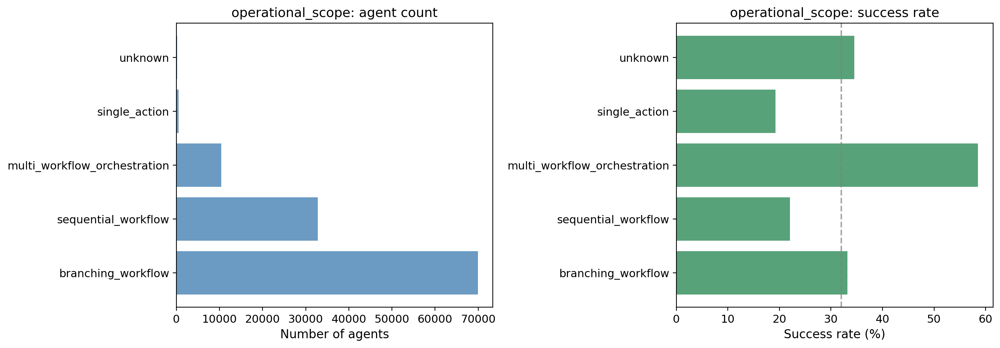

**Inference:** Multi_workflow_orchestration has the highest success rate (59%) and is a minority; branching is most common with moderate success rate (33%); sequential has the lowest success rate (22%).

**Direction (success vs fail)**

- **Population:** multi_workflow_orchestration (0.59) and branching (0.33) lead; sequential (0.22) and single_action (0.19) trail.
- **Prompts-only model:** operational_scope=multi_workflow_orchestration has high RF importance (0.034) and strong positive logistic (+0.155); operational_scope=sequential_workflow is negative (−0.115). SHAP direction aligns: multi_workflow positive, sequential negative.

**Correlation with tools, triggers, templates**  
See table above. Multi-workflow orchestration correlates with scheduled trigger and task/todo tools; sequential_workflow correlates negatively with those.

**Other insights**  
Orchestration and branching are directionally more successful; simplifying to "sequential" in the prompt may be associated with lower success.

**Footnotes**  
Correlations are agent-level Pearson (|r| ≥ 0.05); primary trigger/template and avg tool usage per run. **Correlation color code:** Green = positive correlation with this dimension value; Red = negative correlation.

---

### 5. Data flow direction

**Classification**  
Where data moves relative to ClickUp (inbound, processing, outbound, or bidirectional).

**Distribution**

| Value | What each value means | Dormant | Failure | Success | Success rate | Top 3 tools (pos; r) | Top 3 tools (neg; r) | Top 3 prompts (pos; r) | Top 3 prompts (neg; r) |
|-------|------------------------|---------|---------|---------|--------------|----------------------|----------------------|------------------------|------------------------|
| bidirectional | Requires both importing and exporting. | 3,409 | 723 | 3,957 | 0.49 | search_google_calendar 0.23; view_tools_catalog 0.21 | — | external_integration_scope=email_integration 0.39; external_integration_scope=multiple_external_systems 0.35; output_modality=email_external_message 0.30 | external_integration_scope=clickup_only -0.52; functional_archetype=creator -0.15; output_modality=visual_image -0.10 |
| inbound | Captures external data into ClickUp. | 212 | 45 | 129 | 0.33 | — | — | output_modality=task_artifact 0.11; functional_archetype=organizer 0.09; domain_knowledge_depth=light 0.05 | — |
| outbound | Output leaves ClickUp or is new content. | 38,376 | 1,349 | 8,455 | 0.18 | post_reply 0.27; generate_image 0.18 | todo_write -0.35; retrieve_tasks_by_filters -0.30; load_assets -0.20 | functional_archetype=creator 0.65; domain_knowledge_depth=moderate 0.45; execution_dataset=single_user_prompt 0.44 | domain_industry_vertical=project_management_ops -0.46; functional_archetype=organizer -0.44; domain_knowledge_depth=light -0.36 |
| processing | Restructures ClickUp data; output stays in ClickUp. | 28,432 | 4,476 | 24,108 | 0.42 | todo_write 0.29; retrieve_tasks_by_filters 0.28; load_assets 0.19 | post_reply -0.24; generate_image -0.15 | domain_industry_vertical=project_management_ops 0.45; functional_archetype=organizer 0.34; domain_knowledge_depth=light 0.32 | functional_archetype=creator -0.56; execution_dataset=single_user_prompt -0.41; domain_knowledge_depth=moderate -0.41 |
| unknown | Could not be determined. | 111 | 18 | 63 | 0.33 | — | — | operational_scope=unknown 0.93; functional_archetype=unknown 0.79; autonomy_level=unknown 0.72 | team_orientation=individual -0.16; implied_end_date=false -0.08; external_integration_scope=clickup_only -0.07 |

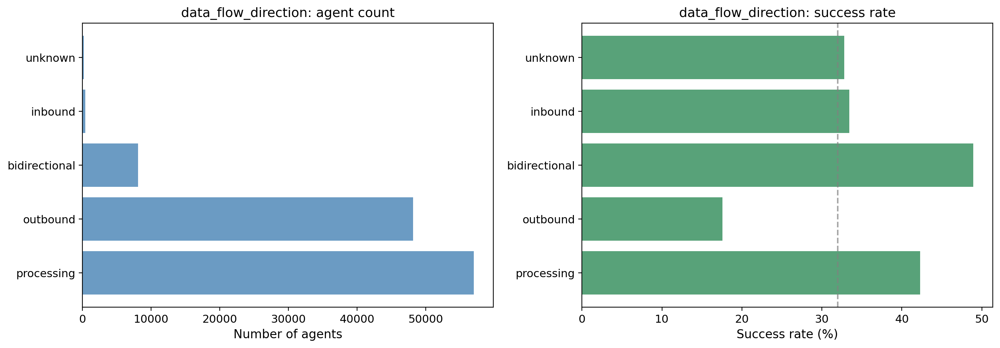

**Inference:** Outbound is most common but has the lowest success rate (18%). Processing and bidirectional have higher success rates (0.42 and 0.49). Outbound-heavy prompts are associated with lower success in the population.

**Direction (success vs fail)**

- **Population:** Bidirectional (0.49) and processing (0.42) lead; outbound (0.18) trails.
- **Prompts-only model:** data_flow_direction=outbound has high RF importance (0.041) but near-zero logistic; data_flow_direction=processing and data_flow_direction=bidirectional have small positive coefficients. data_flow_direction=unknown is negative (−0.04). Direction is mixed; population signal is stronger than model coefficients for outbound.

**Correlation with tools, triggers, templates**  
See table above.

**Other insights**  
Outbound-dominant prompts are numerous but underperform; balancing with processing or bidirectional semantics may be worth exploring.

**Footnotes**  
Correlations are agent-level Pearson (|r| ≥ 0.05); primary trigger/template and avg tool usage per run. **Correlation color code:** Green = positive correlation with this dimension value; Red = negative correlation.

---

### 6. Autonomy level

**Classification**  
Whether the agent asks before acting, acts then reports, or acts silently (consultative, human_in_the_loop, autonomous, enforcer, monitor).

**Distribution**

| Value | What each value means | Dormant | Failure | Success | Success rate | Top 3 tools (pos; r) | Top 3 tools (neg; r) | Top 3 prompts (pos; r) | Top 3 prompts (neg; r) |
|-------|------------------------|---------|---------|---------|--------------|----------------------|----------------------|------------------------|------------------------|
| autonomous | Acts without asking; handles edge cases via rules. | 25,952 | 3,818 | 20,242 | 0.40 | todo_write 0.21; retrieve_tasks_by_filters 0.17; retrieve_activity 0.14 | post_reply -0.18 | functional_archetype=monitor 0.28; data_flow_direction=processing 0.18; domain_industry_vertical=project_management_ops 0.15 | execution_dataset=single_user_prompt -0.22; functional_archetype=creator -0.17; domain_knowledge_depth=moderate -0.16 |
| consultative | Asks user before acting; human gates the action. | 34,320 | 1,466 | 9,130 | 0.20 | post_reply 0.24 | todo_write -0.28; retrieve_tasks_by_filters -0.20; load_assets -0.14 | execution_dataset=single_user_prompt 0.35; data_flow_direction=outbound 0.30; functional_archetype=creator 0.29 | data_flow_direction=processing -0.28; functional_archetype=monitor -0.22; domain_industry_vertical=project_management_ops -0.21 |
| human_in_the_loop | Acts first, then reports for human review. | 10,070 | 1,294 | 7,222 | 0.39 | load_assets 0.10 | — | functional_archetype=organizer 0.23; operational_scope=multi_workflow_orchestration 0.16; output_modality=task_artifact 0.14 | data_flow_direction=outbound -0.18; execution_dataset=single_user_prompt -0.16; functional_archetype=creator -0.15 |
| unknown | Could not be determined. | 198 | 33 | 118 | 0.34 | — | — | operational_scope=unknown 0.74; data_flow_direction=unknown 0.72; functional_archetype=unknown 0.58 | team_orientation=individual -0.19; implied_end_date=false -0.10; operational_scope=branching_workflow -0.07 |

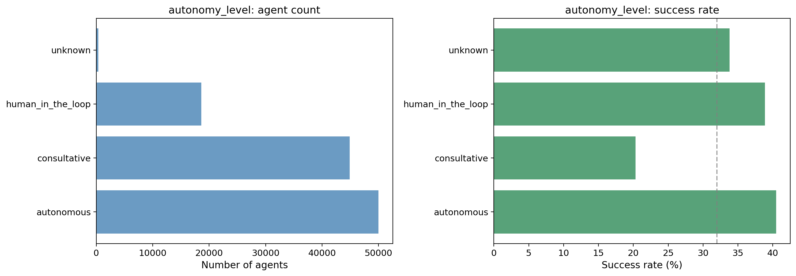

**Inference:** Consultative is most common but has the lowest success rate (20%). Autonomous and human_in_the_loop have higher success rates (~0.39–0.40). More autonomous prompts associate with higher success.

**Direction (success vs fail)**

- **Population:** Autonomous and human_in_the_loop ~0.39–0.40; consultative 0.20.
- **Prompts-only model:** autonomy_level=consultative has negative coefficient (−0.09); autonomy_level=autonomous positive (+0.08). RF importance: consultative (0.023), autonomous (0.011). Direction aligns: consultative toward failure, autonomous toward success.

**Correlation with tools, triggers, templates**  
See table above. Consultative correlates with introduction or low automation; autonomous with scheduled and task/memory tools.

**Other insights**  
Consultative framing may reduce success; encouraging clearer autonomous or human-in-the-loop patterns in prompts could help.

**Footnotes**  
Correlations are agent-level Pearson (|r| ≥ 0.05); primary trigger/template and avg tool usage per run. **Correlation color code:** Green = positive correlation with this dimension value; Red = negative correlation.

---

### 7. Tone and persona

**Classification**  
Communication style (professional_formal, casual_friendly, technical_precise, empathetic_supportive).

**Distribution**

| Value | What each value means | Dormant | Failure | Success | Success rate | Top 3 tools (pos; r) | Top 3 tools (neg; r) | Top 3 prompts (pos; r) | Top 3 prompts (neg; r) |
|-------|------------------------|---------|---------|---------|--------------|----------------------|----------------------|------------------------|------------------------|
| casual_friendly | Warm, conversational, approachable. | 25,901 | 1,311 | 9,438 | 0.26 | post_reply 0.10; edit_image 0.09 | todo_write -0.13; load_assets -0.12; load_custom_fields -0.08 | domain_industry_vertical=creative_design 0.24; output_modality=visual_image 0.22; functional_archetype=creator 0.20 | data_flow_direction=processing -0.15; domain_knowledge_depth=deep -0.14; domain_industry_vertical=project_management_ops -0.14 |
| empathetic_supportive | Encouraging, coaching, patient. | 8,340 | 448 | 3,366 | 0.28 | — | — | use_case_context=personal_use_case 0.35; domain_industry_vertical=education_academic 0.33; domain_industry_vertical=personal_productivity 0.16 | domain_industry_vertical=project_management_ops -0.17; use_case_context=general_productivity -0.14; use_case_context=specific_use_case -0.14 |
| professional_formal | Concise, structured, executive-ready. | 30,774 | 4,108 | 20,853 | 0.37 | todo_write 0.14; load_assets 0.12; retrieve_tasks_by_filters 0.09 | post_reply -0.10; generate_image -0.07 | domain_industry_vertical=project_management_ops 0.25; data_flow_direction=processing 0.20; use_case_context=specific_use_case 0.16 | functional_archetype=creator -0.24; use_case_context=personal_use_case -0.23; data_flow_direction=outbound -0.23 |
| technical_precise | Data-driven, rigorous, systematic. | 4,681 | 560 | 2,427 | 0.32 | — | — | domain_industry_vertical=it_engineering 0.23; functional_archetype=analyzer 0.10; domain_knowledge_depth=deep 0.08 | operational_scope=branching_workflow -0.06; domain_knowledge_depth=none -0.05; domain_industry_vertical=education_academic -0.05 |
| unknown | Could not be determined. | 844 | 184 | 628 | 0.38 | — | — | autonomy_level=unknown 0.18; operational_scope=single_action 0.17; team_orientation=unknown 0.16 | operational_scope=branching_workflow -0.08; implied_end_date=false -0.08; team_orientation=individual -0.06 |

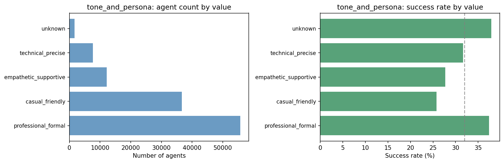

**Inference:** Professional_formal and casual_friendly dominate. Professional_formal has the highest success rate among the main categories (0.37); casual_friendly and empathetic_supportive are lower (~0.26–0.28).

**Direction (success vs fail)**

- **Population:** professional_formal (0.37) leads; casual_friendly (0.26) and empathetic_supportive (0.28) trail.
- **Prompts-only model:** RF importance is low for tone (~0.001–0.003). Logistic: tone_and_persona=casual_friendly −0.04, tone_and_persona=professional_formal +0.01, technical_precise +0.01, empathetic_supportive +0.01. Tone has modest directional signal.

**Correlation with tools, triggers, templates**  
See table above.

**Other insights**  
Tone is a weaker driver than archetype or scope; formal tone is slightly associated with higher success.

**Footnotes**  
Correlations are agent-level Pearson (|r| ≥ 0.05); primary trigger/template and avg tool usage per run. **Correlation color code:** Green = positive correlation with this dimension value; Red = negative correlation.

---

### 8. Domain industry vertical

**Classification**  
Which industry or functional area the agent serves (PM, sales, marketing, HR, legal, finance, education, personal, creative, engineering, general).

**Distribution**

| Value | What each value means | Dormant | Failure | Success | Success rate | Top 3 tools (pos; r) | Top 3 tools (neg; r) | Top 3 prompts (pos; r) | Top 3 prompts (neg; r) |
|-------|------------------------|---------|---------|---------|--------------|----------------------|----------------------|------------------------|------------------------|
| creative_design | Graphic design, UI/UX, image generation, video. | 15,044 | 182 | 1,034 | 0.06 | edit_image 0.26; generate_image 0.21; post_reply 0.18 | todo_write -0.26; retrieve_tasks_by_filters -0.19; load_assets -0.15 | output_modality=visual_image 0.65; functional_archetype=creator 0.45; data_flow_direction=outbound 0.39 | data_flow_direction=processing -0.33; output_modality=messages -0.27; functional_archetype=organizer -0.22 |
| education_academic | Teaching, tutoring, coursework, exam prep. | 10,670 | 151 | 1,625 | 0.13 | — | todo_write -0.15; retrieve_tasks_by_filters -0.12 | use_case_context=personal_use_case 0.64; tone_and_persona=empathetic_supportive 0.33; functional_archetype=creator 0.27 | use_case_context=general_productivity -0.23; tone_and_persona=professional_formal -0.18; use_case_context=specific_use_case -0.18 |
| finance_accounting | Budgeting, invoicing, financial reporting. | 1,991 | 215 | 1,587 | 0.42 | — | — | functional_archetype=analyzer 0.14; use_case_context=specific_use_case 0.13; domain_knowledge_depth=deep 0.13 | use_case_context=general_productivity -0.13; functional_archetype=creator -0.09; domain_knowledge_depth=light -0.08 |
| general_cross_functional | General-purpose or no specific vertical. | 5,712 | 308 | 1,996 | 0.25 | — | — | external_integration_scope=web_research_integration 0.12; functional_archetype=communicator 0.11; functional_archetype=analyzer 0.10 | external_integration_scope=clickup_only -0.11; domain_knowledge_depth=light -0.08; data_flow_direction=processing -0.06 |
| hr_people | Hiring, recruiting, onboarding, performance. | 1,210 | 140 | 764 | 0.36 | — | — | use_case_context=specific_use_case 0.09; domain_knowledge_depth=deep 0.05 | use_case_context=general_productivity -0.09 |
| it_engineering | Software dev, coding, debugging, DevOps. | 3,065 | 208 | 1,135 | 0.26 | — | — | tone_and_persona=technical_precise 0.23; domain_knowledge_depth=moderate 0.09; output_modality=unknown 0.05 | domain_knowledge_depth=light -0.07; domain_knowledge_depth=none -0.06; tone_and_persona=professional_formal -0.05 |
| legal_compliance | Legal, contracts, compliance, regulatory. | 1,601 | 116 | 847 | 0.33 | — | — | domain_knowledge_depth=deep 0.32; use_case_context=specific_use_case 0.14; tone_and_persona=professional_formal 0.10 | use_case_context=general_productivity -0.11; tone_and_persona=casual_friendly -0.09; domain_knowledge_depth=light -0.09 |
| marketing_content | Content, social, SEO, campaigns, branding. | 9,869 | 673 | 4,695 | 0.31 | — | — | use_case_context=specific_use_case 0.30; domain_knowledge_depth=moderate 0.29; functional_archetype=creator 0.22 | use_case_context=general_productivity -0.23; domain_knowledge_depth=light -0.21; data_flow_direction=processing -0.18 |
| personal_productivity | Personal planning, habits, journaling. | 2,059 | 464 | 3,008 | 0.54 | retrieve_personal_priorities 0.22; search_google_calendar 0.18 | — | use_case_context=personal_productivity 0.38; external_integration_scope=calendar_integration 0.19; domain_knowledge_depth=none 0.16 | use_case_context=specific_use_case -0.19; functional_archetype=creator -0.14; tone_and_persona=professional_formal -0.13 |
| project_management_ops | Projects, sprints, standups, deadlines. | 17,324 | 3,799 | 18,164 | 0.46 | todo_write 0.28; retrieve_tasks_by_filters 0.26; retrieve_activity 0.21 | post_reply -0.23; generate_image -0.12 | use_case_context=general_productivity 0.51; domain_knowledge_depth=light 0.50; data_flow_direction=processing 0.45 | domain_knowledge_depth=moderate -0.54; functional_archetype=creator -0.50; data_flow_direction=outbound -0.46 |
| sales_crm | Deals, pipeline, leads, CRM, revenue. | 1,980 | 348 | 1,847 | 0.44 | — | — | use_case_context=specific_use_case 0.21; data_flow_direction=bidirectional 0.08; functional_archetype=organizer 0.08 | use_case_context=general_productivity -0.15; functional_archetype=creator -0.12; data_flow_direction=outbound -0.07 |
| unknown | Could not be determined. | 15 | 7 | 10 | 0.31 | — | — | domain_knowledge_depth=unknown 0.77; functional_archetype=unknown 0.50; data_flow_direction=unknown 0.41 | team_orientation=individual -0.08; implied_end_date=false -0.07 |

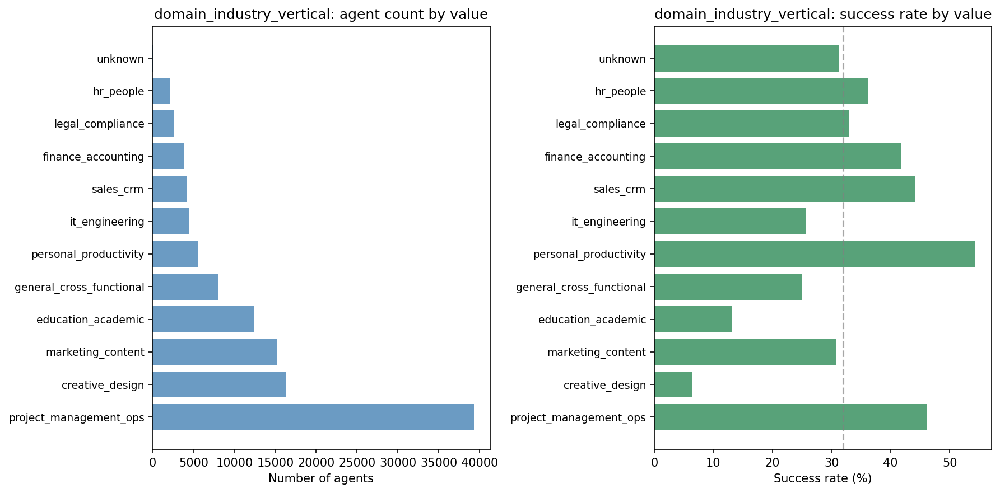

**Inference:** creative_design and education_academic have very low success rates (0.06 and 0.13); personal_productivity and project_management_ops are higher (0.54 and 0.46). Vertical strongly differentiates success.

**Direction (success vs fail)**

- **Population:** personal_productivity (0.54), project_management_ops (0.46), sales_crm (0.44), finance_accounting (0.42) lead; creative_design (0.06), education_academic (0.13) trail.
- **Prompts-only model:** domain_industry_vertical=creative_design has negative coefficient (−0.19), domain_industry_vertical=education_academic (−0.13); domain_industry_vertical=marketing_content (+0.14), domain_industry_vertical=personal_productivity (+0.10), domain_industry_vertical=project_management_ops (+0.07) positive. RF importance: creative_design (0.035), project_management_ops (0.027).

**Correlation with tools, triggers, templates**  
See table above. Vertical correlates with tool mix (e.g. creative with generate_image, PM with task tools).

**Other insights**  
Creative and education verticals underperform; PM, sales, finance, personal productivity align with success. Vertical-specific onboarding could emphasize successful verticals.

**Footnotes**  
Correlations are agent-level Pearson (|r| ≥ 0.05); primary trigger/template and avg tool usage per run. **Correlation color code:** Green = positive correlation with this dimension value; Red = negative correlation.

---

### 9. External integration scope

**Classification**  
Extent of integration with systems outside ClickUp (clickup_only, email, calendar, web_research, multiple_external_systems).

**Distribution**

| Value | What each value means | Dormant | Failure | Success | Success rate | Top 3 tools (pos; r) | Top 3 tools (neg; r) | Top 3 prompts (pos; r) | Top 3 prompts (neg; r) |
|-------|------------------------|---------|---------|---------|--------------|----------------------|----------------------|------------------------|------------------------|
| calendar_integration | Integrates with calendar. | 921 | 280 | 1,192 | 0.50 | search_google_calendar 0.46; create_google_calendar_event 0.27; check_calendar_availability 0.17 | — | data_flow_direction=bidirectional 0.26; domain_industry_vertical=personal_productivity 0.19; functional_archetype=organizer 0.13 | functional_archetype=creator -0.11; domain_knowledge_depth=moderate -0.10; data_flow_direction=outbound -0.08 |
| clickup_only | No external integrations; ClickUp only. | 59,726 | 5,186 | 28,713 | 0.31 | — | search_public_web -0.31; load_web_pages -0.28; search_google_calendar -0.23 | data_flow_direction=processing 0.31; output_modality=visual_image 0.14; domain_industry_vertical=creative_design 0.13 | data_flow_direction=bidirectional -0.52; output_modality=email_external_message -0.26; functional_archetype=communicator -0.16 |
| email_integration | Integrates with email. | 1,044 | 326 | 1,468 | 0.52 | gmail_create_draft 0.22; view_tools_catalog 0.21 | — | output_modality=email_external_message 0.60; data_flow_direction=bidirectional 0.39; functional_archetype=communicator 0.30 | data_flow_direction=processing -0.13; functional_archetype=creator -0.11; data_flow_direction=outbound -0.07 |
| multiple_external_systems | Multiple external systems. | 1,348 | 285 | 1,541 | 0.49 | search_google_calendar 0.22 | — | data_flow_direction=bidirectional 0.35; operational_scope=multi_workflow_orchestration 0.17; domain_industry_vertical=personal_productivity 0.14 | data_flow_direction=processing -0.14; functional_archetype=creator -0.07; output_modality=visual_image -0.06 |
| unknown | Could not be determined. | 352 | 133 | 527 | 0.52 | post_slack_message 0.30 | — | operational_scope=unknown 0.37; data_flow_direction=unknown 0.37; autonomy_level=unknown 0.33 | team_orientation=individual -0.14 |
| web_research_integration | Uses web/search or research tools. | 7,149 | 401 | 3,271 | 0.30 | search_public_web 0.38; load_web_pages 0.35 | retrieve_tasks_by_filters -0.11 | domain_knowledge_depth=moderate 0.16; data_flow_direction=outbound 0.15; execution_dataset=single_user_prompt 0.14 | data_flow_direction=processing -0.21; domain_industry_vertical=project_management_ops -0.19; use_case_context=general_productivity -0.17 |

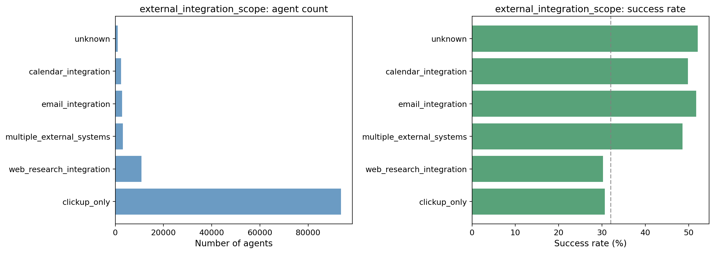

**Inference:** clickup_only dominates but has the lowest success rate (0.31). Email, calendar, and multiple_external_systems have higher success rates (0.49–0.52). External integration in the prompt associates with higher success.

**Direction (success vs fail)**

- **Population:** email_integration (0.52), calendar (0.50), multiple_external_systems (0.49) lead; clickup_only (0.31) trails.
- **Prompts-only model:** external_integration_scope=clickup_only has negative coefficient (−0.05); external_integration_scope=web_research_integration (+0.03), external_integration_scope=multiple_external_systems (+0.02) positive. RF importance is modest. Direction aligns: clickup_only toward lower success, integrations toward higher.

**Correlation with tools, triggers, templates**  
See table above. Calendar/email scope correlates with calendar/email tools and possibly scheduled trigger.

**Other insights**  
Prompts that imply external integrations (email, calendar, multiple systems) associate with higher success than clickup_only.

**Footnotes**  
Correlations are agent-level Pearson (|r| ≥ 0.05); primary trigger/template and avg tool usage per run. **Correlation color code:** Green = positive correlation with this dimension value; Red = negative correlation.

---

### 10. Use case context

**Classification**  
High-level context of how the agent is used (specific workflow, general productivity, personal, entertainment, test_or_placeholder).

**Distribution**

| Value | What each value means | Dormant | Failure | Success | Success rate | Top 3 tools (pos; r) | Top 3 tools (neg; r) | Top 3 prompts (pos; r) | Top 3 prompts (neg; r) |
|-------|------------------------|---------|---------|---------|--------------|----------------------|----------------------|------------------------|------------------------|
| entertainment | Entertainment or non-work. | 404 | 15 | 79 | 0.16 | — | — | domain_industry_vertical=creative_design 0.08; data_flow_direction=outbound 0.07; tone_and_persona=casual_friendly 0.06 | data_flow_direction=processing -0.06; tone_and_persona=professional_formal -0.05 |
| general_productivity | General productivity assistance. | 24,106 | 3,445 | 16,502 | 0.37 | retrieve_activity 0.15; retrieve_tasks_by_filters 0.14; retrieve_personal_priorities 0.13 | post_reply -0.11; search_public_web -0.10 | domain_industry_vertical=project_management_ops 0.51; domain_knowledge_depth=light 0.38; domain_knowledge_depth=none 0.32 | domain_knowledge_depth=moderate -0.44; domain_industry_vertical=education_academic -0.23; domain_industry_vertical=marketing_content -0.23 |
| personal_productivity | Personal productivity. | 3,327 | 209 | 1,792 | 0.34 | — | — | domain_industry_vertical=personal_productivity 0.38; tone_and_persona=casual_friendly 0.11; domain_industry_vertical=creative_design 0.09 | tone_and_persona=professional_formal -0.15; domain_industry_vertical=project_management_ops -0.14; domain_industry_vertical=education_academic -0.07 |
| personal_use_case | Personal use (e.g. study, habits). | 12,134 | 232 | 2,932 | 0.19 | post_reply 0.12 | todo_write -0.12; retrieve_tasks_by_filters -0.10; retrieve_activity -0.09 | domain_industry_vertical=education_academic 0.64; tone_and_persona=empathetic_supportive 0.35; functional_archetype=creator 0.22 | domain_industry_vertical=project_management_ops -0.27; tone_and_persona=professional_formal -0.23; domain_knowledge_depth=light -0.16 |
| specific_use_case | Tied to a specific workflow or business use case. | 30,524 | 2,703 | 15,386 | 0.32 | load_assets 0.10; load_custom_fields 0.10 | retrieve_personal_priorities -0.12; post_chat_message -0.10 | domain_industry_vertical=marketing_content 0.30; domain_knowledge_depth=moderate 0.28; domain_knowledge_depth=deep 0.21 | domain_knowledge_depth=none -0.27; domain_knowledge_depth=light -0.25; domain_industry_vertical=project_management_ops -0.25 |
| test_or_placeholder | Test or placeholder agent. | 33 | 2 | 19 | 0.35 | — | — | implied_end_date=unknown 0.38; domain_industry_vertical=unknown 0.24; domain_knowledge_depth=unknown 0.22 | implied_end_date=false -0.08 |
| unknown | Could not be determined. | 12 | 5 | 2 | 0.11 | — | — | domain_industry_vertical=unknown 0.41; implied_end_date=unknown 0.32; functional_archetype=unknown 0.31 | implied_end_date=false -0.06; team_orientation=individual -0.05 |

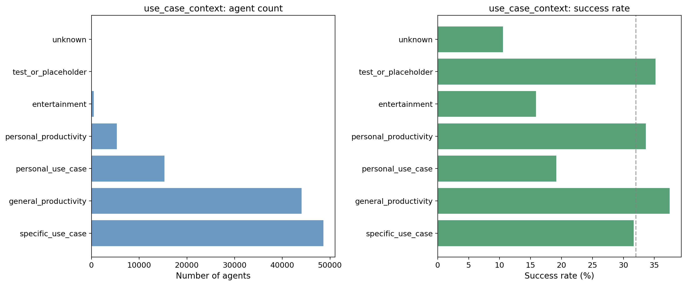

**Inference:** general_productivity has the highest success rate among main categories (0.37); personal_use_case and entertainment are low (0.19 and 0.16). Specific and general productivity contexts perform moderately.

**Direction (success vs fail)**

- **Population:** general_productivity (0.37) leads; personal_use_case (0.19), entertainment (0.16) trail.
- **Prompts-only model:** use_case_context=general_productivity has negative coefficient (−0.05); use_case_context=personal_use_case (+0.04), use_case_context=specific_use_case (+0.02) positive. RF importance is low. Direction is mixed; population and model partially align.

**Correlation with tools, triggers, templates**  
See table above.

**Other insights**  
Use case context is a weaker driver; general productivity in the population aligns with higher success despite negative coefficient (confounding with other dimensions possible).

**Footnotes**  
Correlations are agent-level Pearson (|r| ≥ 0.05); primary trigger/template and avg tool usage per run. **Correlation color code:** Green = positive correlation with this dimension value; Red = negative correlation.

---

### 11. Implied end date

**Classification**  
Whether the agent's use case implies a defined end date (e.g. project end, course end).

**Distribution**

| Value | What each value means | Dormant | Failure | Success | Success rate | Top 3 tools (pos; r) | Top 3 tools (neg; r) | Top 3 prompts (pos; r) | Top 3 prompts (neg; r) |
|-------|------------------------|---------|---------|---------|--------------|----------------------|----------------------|------------------------|------------------------|
| false | No implied end date. | 67,655 | 6,456 | 35,547 | 0.32 | — | — | use_case_context=general_productivity 0.11; output_modality=messages 0.06; operational_scope=branching_workflow 0.06 | use_case_context=personal_use_case -0.13; autonomy_level=unknown -0.10; operational_scope=single_action -0.09 |
| true | Use case implies an end date. | 2,762 | 143 | 1,130 | 0.28 | — | — | use_case_context=personal_use_case 0.13; functional_archetype=organizer 0.07; domain_industry_vertical=education_academic 0.06 | use_case_context=general_productivity -0.11; output_modality=messages -0.06; execution_dataset=single_event_data -0.05 |
| unknown | Could not be determined. | 123 | 12 | 35 | 0.21 | — | — | use_case_context=test_or_placeholder 0.38; domain_industry_vertical=unknown 0.34; use_case_context=unknown 0.32 | team_orientation=individual -0.06 |

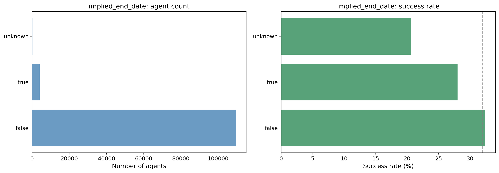

**Inference:** Most agents are false (no implied end date). Success rates are similar (0.28–0.32); implied_end_date has limited differentiation.

**Direction (success vs fail)**

- **Population:** false (0.32) slightly higher than true (0.28).
- **Prompts-only model:** implied_end_date=false has small positive coefficient (+0.03); implied_end_date=true negative (−0.03). RF importance is very low. Dimension has weak directional signal.

**Correlation with tools, triggers, templates**  
See table above.

**Other insights**  
Implied end date is a minor lever; most impact comes from other dimensions (execution_dataset, functional_archetype, domain_industry_vertical).

**Footnotes**  
Correlations are agent-level Pearson (|r| ≥ 0.05); primary trigger/template and avg tool usage per run. **Correlation color code:** Green = positive correlation with this dimension value; Red = negative correlation.

---

## Methodology and footnotes

### Analytical approach

- **Success:** Used ≥1 after **7** days and still **active**; **failure:** inactive/deleted; **dormant:** active but **no use** after 7 days.
- **Prompts-only model:** Predicts success vs non-success from **one-hot** classification columns only.
- **Heatmaps** use per-dimension slices from `leadership_corr_heatmap_map.json` (run `full_feature_readout_analysis.py`); column set is the full classified build plus tools/triggers/templates.

### Prompts-only model detail
### Prompts-only model summary

This section summarizes **Random Forest importance**, **SHAP direction**, and **Logistic regression coefficients** from the prompts-only model (classification dimensions only). **Green** = feature associated with higher success; **red** = associated with lower success.

**Commentary:** The strongest positive predictors are execution_dataset=collection_scoped and functional_archetype=monitor (high RF importance and positive coefficients). The strongest negative predictors are functional_archetype=creator, execution_dataset=single_user_prompt, and execution_dataset=single_asset_from_user. domain_knowledge_depth=light and domain_knowledge_depth=moderate are also notable; domain_industry_vertical=creative_design and education_academic are negative. Below: top 15 RF features (colored by logistic direction), SHAP beeswarm, and significant logistic coefficients.

**Top 15 features by RF importance (direction from logistic regression)**

| Feature | Importance | Direction |
|---------|------------|-----------|
| execution_dataset=collection_scoped | 0.174 | positive |
| functional_archetype=creator | 0.134 | negative |
| functional_archetype=monitor | 0.090 | positive |
| execution_dataset=single_user_prompt | 0.069 | negative |
| execution_dataset=collection_unbounded | 0.047 | positive |
| data_flow_direction=outbound | 0.041 | positive |
| output_modality=visual_image | 0.036 | negative |
| domain_industry_vertical=creative_design | 0.035 | negative |
| operational_scope=multi_workflow_orchestration | 0.034 | positive |
| execution_dataset=single_event_data | 0.031 | negative |
| execution_dataset=single_asset_from_user | 0.027 | negative |
| domain_industry_vertical=project_management_ops | 0.027 | positive |
| autonomy_level=consultative | 0.023 | negative |
| domain_knowledge_depth=moderate | 0.022 | negative |
| data_flow_direction=processing | 0.018 | negative |

**SHAP beeswarm (prompts-only)**

**Significant logistic coefficients (|coefficient| ≥ 0.05)**

- **Positive (green):** execution_dataset=collection_scoped (0.346); execution_dataset=collection_unbounded (0.228); functional_archetype=monitor (0.218); operational_scope=multi_workflow_orchestration (0.155); domain_industry_vertical=marketing_content (0.138); domain_industry_vertical=personal_productivity (0.096); autonomy_level=autonomous (0.083); output_modality=messages (0.082); functional_archetype=communicator (0.079); domain_industry_vertical=project_management_ops (0.073); output_modality=task_artifact (0.072)
- **Negative (red):** state_persistence=unknown (-0.054); execution_dataset=single_event_data (-0.068); autonomy_level=consultative (-0.092); operational_scope=sequential_workflow (-0.115); domain_industry_vertical=education_academic (-0.131); domain_industry_vertical=creative_design (-0.190); functional_archetype=creator (-0.200); output_modality=visual_image (-0.202); execution_dataset=single_asset_from_user (-0.258); execution_dataset=single_user_prompt (-0.273)

### Success vs failure criteria
- **Parameters:** `analysis_reference_date` (cohort_metadata.yaml); `days_post_creation` = 7.
### Assumptions
- Classified cohort only.
- Correlation is agent-level (primary trigger/template; average tool calls per run).
### Limitations
- **Correlation ≠ causation.**
- Pearson **r**; top pairs in tables typically |r| ≥ **0.05**.
- Tool/trigger/template coverage depends on the agent-level extract.
### Correlation color code (dimension tables)
- **Green** = positive association with that dimension value; **red** = negative.
