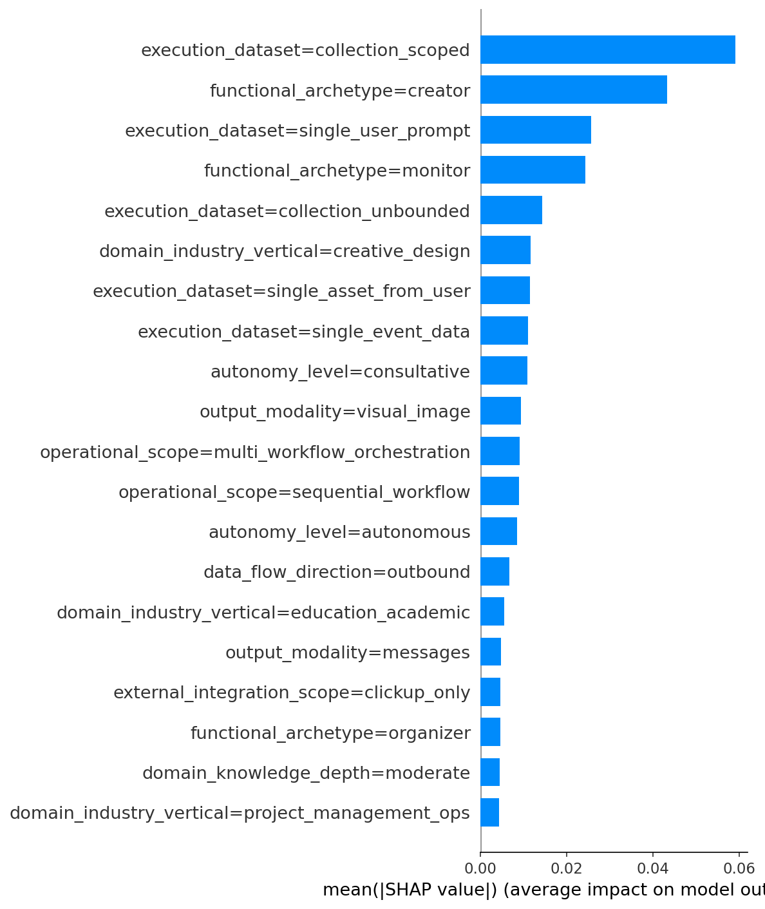

# Prompts SHAP — full sample readout

**Last updated:** Generated from analysis outputs.
**Scope:** SHAP for the **prompts-only** model (one-hot encoded classification dimensions only) computed on the **full classified cohort** — all agents with classifications, no sample cap.

---

## 1. Methodology

- **Model:** Random Forest (n_estimators=100, max_depth=10) predicting success vs non-success. Features = one-hot encoded classification dimensions (14 dimensions, `business_items` excluded); `unknown` kept as a category.
- **SHAP:** TreeExplainer with background and `shap_values` computed on the **full** feature matrix (all agents in the classified cohort). No 500-agent or other sample limit.
- **Outputs:** Mean SHAP and mean |SHAP| per feature over all agents; beeswarm and bar plots include **all** one-hot prompt features; average SHAP per feature value (value=0 vs value=1) over full cohort.
- **Cohort:** Same as main agent success readout (success = used at least once after 7 days and still active; failure = inactive/deleted; dormant = active but no use after 7 days). Only agents in `agent_classifications.csv` are included.

---

## 2. SHAP direction (full cohort)

Mean signed SHAP and mean absolute SHAP per feature over **all** agents. Positive mean SHAP → feature associated with higher success; negative → lower success.

Full table: [classification_prompts_only_shap_direction.csv](../analysis/output/classification_prompts_only_shap_direction.csv).

**Top 25 features by mean absolute SHAP**

| Feature | mean_shap | mean_abs_shap |
|---------|-----------|---------------|
| execution_dataset=collection_scoped | -0.0089 | 0.0590 |
| functional_archetype=creator | 0.0013 | 0.0433 |
| execution_dataset=single_user_prompt | -0.0012 | 0.0257 |
| functional_archetype=monitor | 0.0013 | 0.0244 |
| execution_dataset=collection_unbounded | 0.0039 | 0.0144 |
| domain_industry_vertical=creative_design | 0.0024 | 0.0117 |
| execution_dataset=single_asset_from_user | 0.0026 | 0.0116 |
| execution_dataset=single_event_data | -0.0017 | 0.0110 |
| autonomy_level=consultative | 0.0002 | 0.0110 |
| output_modality=visual_image | 0.0002 | 0.0094 |
| operational_scope=multi_workflow_orchestration | 0.0041 | 0.0091 |
| operational_scope=sequential_workflow | 0.0012 | 0.0090 |
| autonomy_level=autonomous | 0.0009 | 0.0086 |
| data_flow_direction=outbound | -0.0007 | 0.0068 |
| domain_industry_vertical=education_academic | -0.0004 | 0.0056 |
| output_modality=messages | 0.0006 | 0.0048 |
| external_integration_scope=clickup_only | 0.0002 | 0.0047 |
| functional_archetype=organizer | -0.0004 | 0.0046 |
| domain_knowledge_depth=moderate | 0.0003 | 0.0046 |
| domain_industry_vertical=project_management_ops | 0.0006 | 0.0043 |
| domain_industry_vertical=marketing_content | -0.0003 | 0.0040 |
| state_persistence=unknown | -0.0005 | 0.0032 |
| domain_industry_vertical=personal_productivity | 0.0006 | 0.0023 |
| domain_knowledge_depth=light | 0.0001 | 0.0022 |
| functional_archetype=communicator | 0.0001 | 0.0019 |

---

## 3. SHAP beeswarm

Beeswarm plot: SHAP value (x) vs feature (y) for **all** one-hot prompt features. Each point is one agent (full cohort).

---

## 4. SHAP bar (mean |SHAP|)

Bar plot of mean absolute SHAP per feature — **all** prompt features included.

---

## 5. Average SHAP per feature value

For each one-hot feature: mean SHAP when **value=0** vs **value=1** over the full cohort. Value=1 with positive mean_shap → feature pushes toward success; value=1 with negative mean_shap → toward failure.

Full table: [classification_prompts_only_shap_by_value.csv](../analysis/output/classification_prompts_only_shap_by_value.csv).

**Top 15 features (value=1) by |mean SHAP|**

| Feature | value | mean_shap | n_agents |
|---------|-------|-----------|----------|
| functional_archetype=monitor | 1 | 0.0959 | 67 |
| execution_dataset=collection_scoped | 1 | 0.0888 | 141 |
| execution_dataset=collection_unbounded | 1 | 0.0786 | 58 |
| operational_scope=multi_workflow_orchestration | 1 | 0.0704 | 47 |
| functional_archetype=creator | 1 | -0.0524 | 200 |
| execution_dataset=single_user_prompt | 1 | -0.0509 | 132 |
| execution_dataset=single_asset_from_user | 1 | -0.0497 | 45 |
| output_modality=visual_image | 1 | -0.0374 | 62 |
| domain_industry_vertical=creative_design | 1 | -0.0357 | 65 |
| domain_industry_vertical=personal_productivity | 1 | 0.0305 | 24 |
| execution_dataset=single_event_data | 1 | -0.0261 | 122 |
| domain_industry_vertical=education_academic | 1 | -0.0236 | 63 |
| functional_archetype=communicator | 1 | 0.0226 | 23 |
| data_flow_direction=bidirectional | 1 | 0.0167 | 26 |
| team_orientation=larger_team | 1 | 0.0163 | 5 |

---

*Readout built by analysis/build_prompts_shap_full_sample_readout.py from classification_success_analysis.py outputs.*